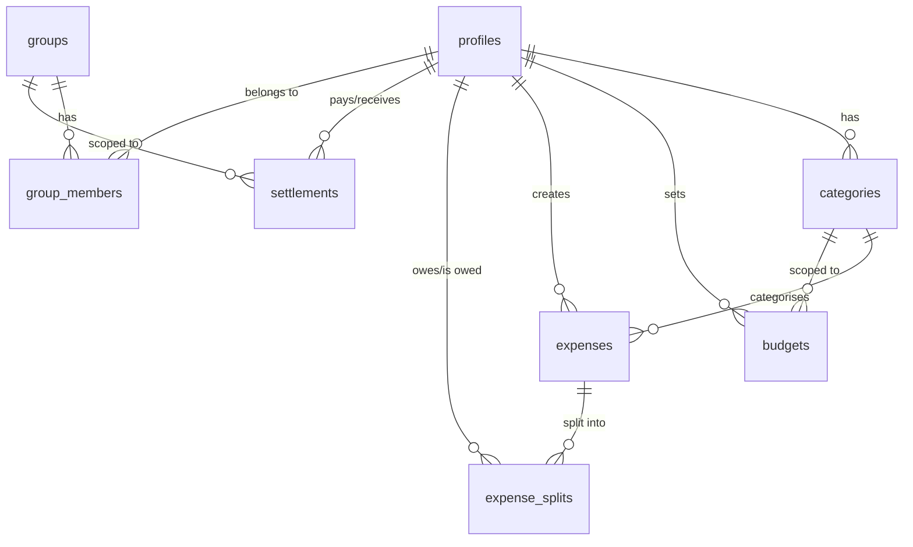

# Database Setup Summary — Expense Manager

## Supabase Project
- **Project**: `expense-manager`
- **Project ID**: `geiqnjxucmgkhqkrvpcn`
- **Region**: `ap-south-1` (Mumbai)
- **Status**: Active & Healthy

---

## Tables Created (8 migrations)

| # | Table | RLS | Key Features |
|---|-------|-----|-------------|
| 1 | **profiles** | ✅ | Extends `auth.users`, auto-created on signup via trigger |
| 2 | **categories** | ✅ | 10 defaults seeded on signup, unique per user |
| 3 | **budgets** | ✅ | Monthly/weekly, overall or per-category, `amount > 0` check |
| 4 | **expenses** | ✅ | `amount > 0`, auto `updated_at` trigger, composite indexes |
| 5 | **groups** | ✅ | RLS via `is_group_member()` security definer function |
| 6 | **group_members** | ✅ | Unique constraint on `(group_id, user_id)` |
| 7 | **expense_splits** | ✅ | `no_self_debt` check, partial index on unsettled splits, **Realtime enabled** |
| 8 | **settlements** | ✅ | `no_self_payment` check, **Realtime enabled** |

---

## Best Practices Applied

### Schema Design
- ✅ `timestamptz` (not `timestamp`) for all timestamps
- ✅ `text` (not `varchar`) for string fields
- ✅ `numeric(12,2)` for monetary amounts (exact arithmetic)
- ✅ `CHECK` constraints for data validation (`amount > 0`, `month 1-12`, valid periods)
- ✅ Self-referencing checks (`debtor_id != creditor_id`, `payer_id != payee_id`)

### Indexes (16 total)
- ✅ All foreign key columns indexed (prevents slow JOINs and CASCADE scans)
- ✅ Composite indexes for common query patterns (e.g., `user_id + expense_date`)
- ✅ Partial index on unsettled splits for balance calculations

### Row Level Security
- ✅ RLS enabled on **all 8 tables**
- ✅ `(select auth.uid())` pattern used everywhere (cached, not called per-row)
- ✅ `security definer` helper function for group membership checks
- ✅ `set search_path = ''` on all security definer functions

### Automation
- ✅ **Auto-create profile** on user signup (`handle_new_user` trigger)
- ✅ **Auto-seed 10 default categories** on profile creation
- ✅ **Auto-update `updated_at`** on expense edits

### Realtime
- ✅ `expense_splits` — instant notification when someone splits with you
- ✅ `settlements` — instant notification when someone settles with you

---

## Generated Files

| File | Description |
|------|-------------|
| [database.types.ts](file:///Volumes/Workspace/Projects/expense-manager/src/types/database.types.ts) | Auto-generated TypeScript types from the database schema |

---

## Migrations Applied

| Version | Name |
|---------|------|
| 20260406200435 | `create_profiles_table` |
| 20260406200449 | `create_categories_table` |
| 20260406200459 | `create_budgets_table` |
| 20260406200511 | `create_expenses_table` |
| 20260406200539 | `create_groups_and_members_tables` |
| 20260406200552 | `create_expense_splits_table` |
| 20260406200602 | `create_settlements_table` |
| 20260406200622 | `fix_update_updated_at_search_path` |

---

## Next Steps (Phase 1 continued)

- [ ] Install Supabase client: `npx expo install @supabase/supabase-js @react-native-async-storage/async-storage`
- [ ] Configure Supabase client in `src/lib/supabase.ts`
- [ ] Build Auth flow (login, register, forgot password screens)
- [ ] Set up authenticated routing in `_layout.tsx`
