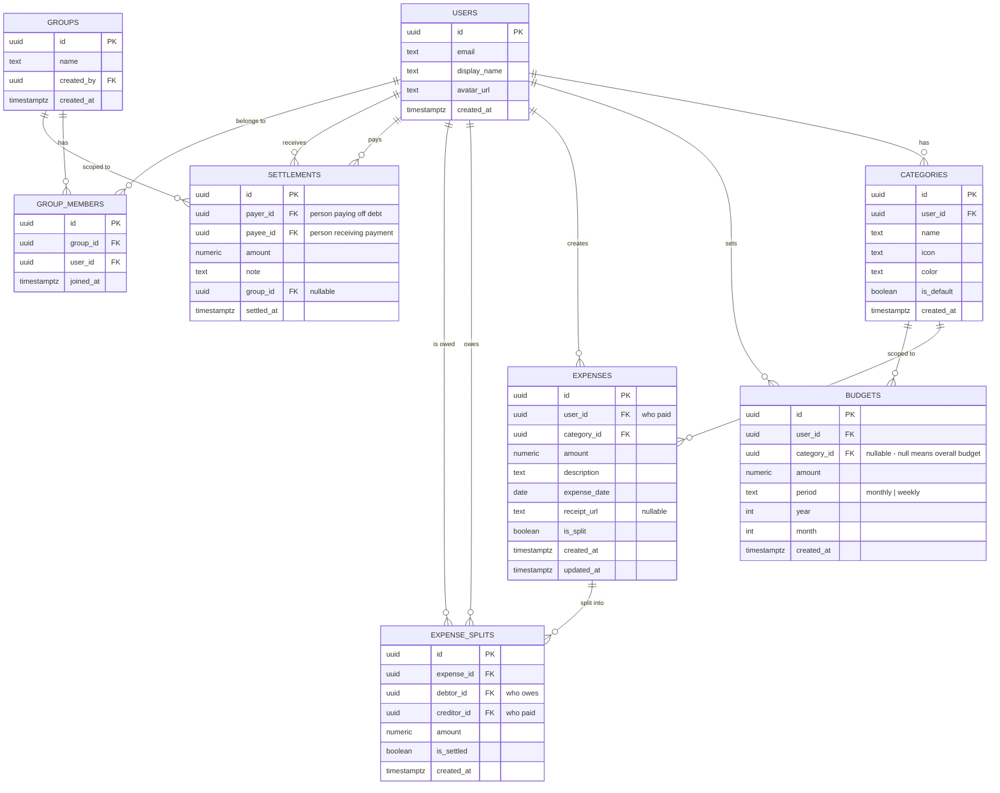

# Budget Tracker & Expense Splitter — Implementation Plan

## 1. Overview

Build a cross-platform (Android / iOS) mobile app that lets users:

- **Track daily expenses** across categories (food, transport, rent, etc.)
- **Set monthly budgets** — overall and per-category
- **Split any expense** with friends/partners
- **Track who owes whom** with a simplified debt graph
- **Record settlements** to zero-out balances
- **View analytics** — category breakdowns, weekly/monthly trends, budget utilisation

---

## 2. Recommended Tech Stack

### Frontend (you already have this set up ✅)

| Layer | Technology | Why |
|---|---|---|
| Framework | **React Native + Expo SDK 55** | Already scaffolded in your repo |
| Navigation | **Expo Router (file-based)** | Already configured |
| State Mgmt | **Zustand** | Tiny, no boilerplate, works seamlessly with React Native |
| Charts | **react-native-gifted-charts** or **Victory Native** | Beautiful, performant chart library for RN |
| Forms | **React Hook Form + Zod** | Lightweight form handling & validation |
| Date Picker | **react-native-date-picker** or **expo-date-time-picker** | Native date/time selection |
| Icons | **@expo/vector-icons** (Ionicons, MaterialIcons) | Bundled with Expo |

### Backend + Database + Auth (all-in-one)

> [!IMPORTANT]
> **I strongly recommend [Supabase](https://supabase.com)** — it's the most frontend-developer-friendly backend available today. Here's why:

| Concern | Supabase Offering | Why it's great for you |
|---|---|---|
| **Database** | PostgreSQL (managed) | Industry-standard relational DB, perfect for financial data with relationships |
| **Auth** | Built-in auth (email, Google, Apple) | 5-minute setup, no custom auth server |
| **API** | Auto-generated REST + Realtime | You write SQL tables → you get an API instantly, no backend code |
| **Realtime** | WebSocket subscriptions | Instant sync when a friend adds/settles an expense |
| **Storage** | S3-compatible file storage | Receipt photos, profile pictures |
| **Edge Functions** | Deno-based serverless functions | For complex logic (debt simplification algorithm) when needed |
| **Free tier** | 500 MB DB, 1 GB storage, 50K MAUs | More than enough for development + early users |
| **Scaling** | One-click upgrade to Pro plan | Handles the "scale later" requirement |

> [!TIP]
> **Why Supabase over Firebase?** Supabase uses PostgreSQL (real relational database) which is ideal for expense tracking where you have many JOIN-heavy relationships (users ↔ expenses ↔ splits ↔ categories ↔ groups). Firebase's NoSQL (Firestore) would require painful data duplication and make queries like "total spending by category for March" unnecessarily complex.

### Additional Backend Libraries

| Library | Purpose |
|---|---|
| `@supabase/supabase-js` | Official Supabase client for React Native |
| `@react-native-async-storage/async-storage` | Persistent token storage for auth sessions |
| `expo-secure-store` | Secure storage for auth tokens (already in Expo) |

---

## 3. Database Schema (PostgreSQL via Supabase)



---

## 4. App Screens & Navigation Structure

```
src/app/
├── _layout.tsx                     # Root layout (ThemeProvider, AuthProvider)
├── (auth)/                         # Auth group (unauthenticated)
│   ├── _layout.tsx
│   ├── login.tsx
│   ├── register.tsx
│   └── forgot-password.tsx
├── (tabs)/                         # Main tab navigation (authenticated)
│   ├── _layout.tsx                 # Bottom tab bar config
│   ├── index.tsx                   # 🏠 Dashboard / Home
│   ├── expenses/
│   │   ├── _layout.tsx
│   │   ├── index.tsx               # 📋 Expense List (filterable)
│   │   └── [id].tsx                # Expense Detail
│   ├── budget/
│   │   ├── _layout.tsx
│   │   ├── index.tsx               # 💰 Budget Overview
│   │   └── [categoryId].tsx        # Category Budget Detail
│   ├── splits/
│   │   ├── _layout.tsx
│   │   ├── index.tsx               # 🤝 Split Overview (who owes whom)
│   │   ├── group/[id].tsx          # Group Detail
│   │   └── settle.tsx              # Record Settlement
│   └── profile/
│       ├── index.tsx               # 👤 Profile & Settings
│       └── categories.tsx          # Manage Categories
├── add-expense.tsx                 # ➕ Add/Edit Expense (modal)
└── +not-found.tsx
```

### Screen Descriptions

| Screen | Key Features |
|---|---|
| **Dashboard** | Monthly summary card, spending chart (donut/bar), budget utilisation bars, recent expenses, quick "Add Expense" FAB |
| **Expense List** | Searchable, filterable list grouped by date. Filter by category, date range, split status. Swipe to delete. |
| **Add Expense** | Category picker, amount input, date selector, description, toggle split mode, add split participants & amounts, receipt photo upload |
| **Budget Overview** | Overall monthly budget gauge, per-category progress bars, remaining budget, overspending alerts |
| **Split Overview** | Net balances with each friend, grouped by group. "You owe ₹X to Y" / "Y owes you ₹X". Simplified debts. |
| **Settle** | Select person, enter settlement amount, add optional note, confirm |
| **Profile** | User info, manage categories, notification preferences, export data, logout |

---

## 5. Implementation Phases

### Phase 1: Project Setup & Backend Foundation (Day 1-2)

**Goal:** Supabase project live, database schema created, auth working in-app.

#### Steps:

1. **Create Supabase project**
   - Go to [supabase.com](https://supabase.com), create new project
   - Save the `Project URL` and `anon key`

2. **Create database tables**
   - Use the Supabase SQL Editor to run migration scripts (I'll provide these)
   - Set up Row Level Security (RLS) policies so users can only access their own data

3. **Install dependencies**
   ```bash
   npx expo install @supabase/supabase-js @react-native-async-storage/async-storage
   npm install zustand react-hook-form zod @hookform/resolvers
   ```

4. **Configure Supabase client**
   - Create `src/lib/supabase.ts` with project URL + anon key
   - Configure AsyncStorage as the auth persistence layer

5. **Build Auth flow**
   - Create `src/providers/auth-provider.tsx` — wraps app with auth context
   - Build Login, Register, Forgot Password screens
   - Set up protected routing in `_layout.tsx`

#### Deliverables:
- [ ] Supabase project with all tables
- [ ] RLS policies for data security
- [ ] Auth screens (login, register, forgot password)
- [ ] Authenticated routing

---

### Phase 2: Core Expense Tracking (Day 3-5)

**Goal:** Users can add, view, edit, and delete expenses.

#### Steps:

1. **Create Zustand stores**
   - `src/stores/expense-store.ts` — expense CRUD operations
   - `src/stores/category-store.ts` — categories with defaults

2. **Seed default categories** (via Supabase trigger on user signup)
   - 🍔 Food & Dining
   - 🚗 Transport
   - 🏠 Rent & Housing
   - 🛒 Groceries
   - 🎬 Entertainment
   - 💊 Health
   - 🛍️ Shopping
   - 📱 Subscriptions
   - ⚡ Utilities
   - 📦 Other

3. **Build Add Expense screen**
   - Category picker (grid of icons)
   - Amount input (numeric keypad)
   - Date picker (defaults to today)
   - Description text input
   - Submit → insert into `expenses` table

4. **Build Expense List screen**
   - Fetch expenses from Supabase (paginated)
   - Group by date
   - Category icon + color badges
   - Swipe-to-delete with confirmation
   - Filter chips (by category, date range)

5. **Build Expense Detail screen**
   - Full expense info
   - Edit capability
   - Delete with confirmation

#### Deliverables:
- [ ] Add/edit/delete expenses
- [ ] Expense list with filters
- [ ] Default categories seeded on signup
- [ ] Category management screen

---

### Phase 3: Budget Management (Day 6-7)

**Goal:** Users can set monthly budgets (overall + per-category) and track utilisation.

#### Steps:

1. **Create budget store** — `src/stores/budget-store.ts`

2. **Build Budget Overview screen**
   - Overall monthly budget — circular progress gauge
   - Per-category budget bars (spent / limit)
   - Color-coded: green (< 75%), yellow (75-90%), red (> 90%)
   - "Set Budget" action for each category

3. **Build Set Budget modal**
   - Select category (or "Overall")
   - Enter amount
   - Save to `budgets` table

4. **Dashboard budget widget**
   - Show condensed budget status on home screen

#### Deliverables:
- [ ] Set/edit overall monthly budget
- [ ] Set/edit per-category budgets
- [ ] Visual budget utilisation tracking
- [ ] Overspending alerts

---

### Phase 4: Expense Splitting (Day 8-11)

**Goal:** Split expenses with friends, track balances, record settlements.

#### Steps:

1. **Create split-related stores**
   - `src/stores/split-store.ts`
   - `src/stores/group-store.ts`
   - `src/stores/settlement-store.ts`

2. **Extend Add Expense screen**
   - Toggle "Split this expense" switch
   - When enabled:
     - Search & select friends (from `users` table)
     - Choose split type: Equal, Exact amounts, Percentage
     - Show breakdown preview
   - On save → create `expense_splits` rows

3. **Build Friend/Group management**
   - Add friends by email/username
   - Create groups (e.g., "Roommates", "Trip to Goa")
   - Group members list

4. **Build Split Overview screen**
   - Net balance with each person
   - Simplified debts (A→B ₹500, B→C ₹300 simplifies to A→C ₹300, A→B ₹200)
   - Per-group breakdown

5. **Build Settlement screen**
   - Select person to settle with
   - Enter amount
   - Add optional note
   - Creates `settlement` record and updates split statuses

6. **Debt simplification algorithm** (Supabase Edge Function or client-side)
   ```
   Given: A owes B ₹500, B owes C ₹300
   Simplified: A owes B ₹200, A owes C ₹300
   ```

#### Deliverables:
- [ ] Split expenses (equal/exact/percentage)
- [ ] Friend/group management
- [ ] Balance overview with simplified debts
- [ ] Settlement recording & tracking
- [ ] Settlement history

---

### Phase 5: Dashboard & Analytics (Day 12-14)

**Goal:** Beautiful, insightful dashboard with charts and analytics.

#### Steps:

1. **Install chart library**
   ```bash
   npm install react-native-gifted-charts
   ```

2. **Build Dashboard screen**
   - Monthly spending summary card
   - Donut chart — spending by category
   - Bar chart — daily/weekly spending trend
   - Budget utilisation summary
   - Recent expenses (last 5)
   - FAB — quick "Add Expense"

3. **Build period selector**
   - Switch between weekly / monthly / custom date range
   - Swipe to navigate between periods

4. **Build detailed analytics**
   - Category comparison (this month vs. last month)
   - Average daily spend
   - Top spending categories
   - Spending heatmap (optional — which days you spend most)

#### Deliverables:
- [ ] Dashboard with spending summary
- [ ] Category-wise donut chart
- [ ] Spending trend bar chart
- [ ] Period selector (week/month/custom)
- [ ] Comparative analytics

---

### Phase 6: Real-time Sync & Notifications (Day 15-16)

**Goal:** When a friend splits an expense or settles, you see it instantly.

#### Steps:

1. **Enable Supabase Realtime** on key tables
   - `expense_splits` — notify when someone splits an expense with you
   - `settlements` — notify when someone settles with you

2. **Set up realtime subscriptions** in Zustand stores
   ```typescript
   // In split-store.ts
   supabase
     .channel('splits')
     .on('postgres_changes', {
       event: 'INSERT',
       schema: 'public',
       table: 'expense_splits',
       filter: `debtor_id=eq.${userId}`
     }, handleNewSplit)
     .subscribe();
   ```

3. **Push notifications** (optional — Expo Push Notifications)
   - "John split ₹1,200 (Dinner) with you — your share ₹600"
   - "Sarah settled ₹3,000 with you"

#### Deliverables:
- [ ] Real-time expense split updates
- [ ] Real-time settlement updates
- [ ] Push notifications for key events

---

### Phase 7: Polish & UX (Day 17-19)

**Goal:** Premium, production-quality experience.

#### Steps:

1. **Onboarding flow** — 3-4 screens explaining key features
2. **Haptic feedback** on key actions (add expense, settle)
3. **Animations**
   - Animated budget progress bars
   - List item entrance animations (Reanimated)
   - Modal transitions
4. **Dark mode** — already have theme infrastructure, extend to all screens
5. **Empty states** — beautiful illustrations when no data
6. **Error handling** — graceful error screens, retry mechanisms, offline banner
7. **Receipt photo** — camera/gallery picker, upload to Supabase Storage
8. **Data export** — Export expenses as CSV

#### Deliverables:
- [ ] Onboarding flow
- [ ] Smooth animations throughout
- [ ] Complete dark/light mode support
- [ ] Error handling & offline states
- [ ] Receipt photo upload
- [ ] CSV export

---

### Phase 8: Testing & Deployment (Day 20-21)

**Goal:** Ship to app stores.

#### Steps:

1. **Testing**
   - Manual QA on both Android & iOS simulators
   - Test edge cases (no internet, empty states, large datasets)
   - Test auth flow (login, logout, expired tokens)

2. **App Store Prep**
   - App icon & splash screen (update existing assets)
   - App Store screenshots
   - Privacy policy (required for both stores)

3. **Build & Deploy**
   ```bash
   # Build for both platforms
   eas build --platform all
   
   # Submit to stores
   eas submit --platform ios
   eas submit --platform android
   ```

4. **Supabase production checklist**
   - Enable email confirmation
   - Set up database backups
   - Review & tighten RLS policies
   - Set up monitoring/alerts

#### Deliverables:
- [ ] Production builds for Android & iOS
- [ ] App Store & Play Store submissions
- [ ] Production Supabase configuration

---

## 6. Project Directory Structure (Final)

```
src/
├── app/                          # Expo Router screens
│   ├── _layout.tsx               # Root layout
│   ├── (auth)/                   # Auth screens
│   ├── (tabs)/                   # Tab screens
│   └── add-expense.tsx           # Modal
├── components/                   # Reusable components
│   ├── ui/                       # Design system primitives
│   │   ├── button.tsx
│   │   ├── input.tsx
│   │   ├── card.tsx
│   │   ├── badge.tsx
│   │   ├── progress-bar.tsx
│   │   ├── modal.tsx
│   │   └── fab.tsx
│   ├── expense/                  # Expense-specific components  
│   │   ├── expense-card.tsx
│   │   ├── expense-list.tsx
│   │   ├── category-picker.tsx
│   │   └── split-configurator.tsx
│   ├── budget/                   # Budget components
│   │   ├── budget-gauge.tsx
│   │   └── category-budget-bar.tsx
│   ├── charts/                   # Chart wrappers
│   │   ├── donut-chart.tsx
│   │   ├── bar-chart.tsx
│   │   └── spending-trend.tsx
│   ├── splits/                   # Split components
│   │   ├── balance-card.tsx
│   │   ├── friend-selector.tsx
│   │   └── settlement-card.tsx
│   ├── themed-text.tsx           # ✅ Existing
│   ├── themed-view.tsx           # ✅ Existing
│   └── animated-icon.tsx         # ✅ Existing
├── stores/                       # Zustand stores
│   ├── auth-store.ts
│   ├── expense-store.ts
│   ├── category-store.ts
│   ├── budget-store.ts
│   ├── split-store.ts
│   ├── group-store.ts
│   └── settlement-store.ts
├── lib/                          # Utilities
│   ├── supabase.ts               # Supabase client init
│   ├── debt-simplifier.ts        # Debt graph simplification
│   └── formatters.ts             # Currency, date formatting
├── providers/                    # React context providers
│   └── auth-provider.tsx
├── types/                        # TypeScript types
│   ├── database.types.ts         # Auto-generated from Supabase
│   └── app.types.ts
├── constants/
│   ├── theme.ts                  # ✅ Existing
│   ├── categories.ts             # Default categories
│   └── config.ts                 # App-wide config
├── hooks/                        # Custom hooks
│   ├── use-theme.ts              # ✅ Existing
│   ├── use-expenses.ts
│   ├── use-budget.ts
│   └── use-splits.ts
└── global.css                    # ✅ Existing
```

---

## 7. Key Dependencies to Install

```bash
# Backend & Auth
npx expo install @supabase/supabase-js @react-native-async-storage/async-storage expo-secure-store

# State Management
npm install zustand

# Forms & Validation
npm install react-hook-form zod @hookform/resolvers

# Charts
npm install react-native-gifted-charts react-native-linear-gradient react-native-svg

# Date Picker
npx expo install expo-date-time-picker

# Icons (already bundled with Expo)
# @expo/vector-icons — already available

# Build & Deploy
npm install -g eas-cli
```

---

## 8. Supabase Setup Quick-Start

Here's a condensed guide to get your backend running:

### Step 1: Create Project
1. Go to [supabase.com](https://supabase.com) → New Project
2. Choose a name, password, and region (Mumbai for India)
3. Copy **Project URL** and **anon key** from Settings → API

### Step 2: Create Tables
Run the SQL migrations in Supabase SQL Editor (I'll generate these when we start Phase 1)

### Step 3: Enable RLS
Every table will have Row Level Security enabled so users can only read/write their own data

### Step 4: Generate TypeScript Types
```bash
npx supabase gen types typescript --project-id YOUR_PROJECT_ID > src/types/database.types.ts
```

This auto-generates fully-typed TypeScript interfaces from your database schema — no manual type writing needed!

---

## User Review Required

> [!IMPORTANT]  
> **Please review and provide feedback on the following before I begin implementation:**

1. **Tech Stack**: Are you comfortable with **Supabase** as the backend? The alternative would be Firebase, but as explained above, Supabase's PostgreSQL is much better suited for this financial/relational data model.

2. **Scope Priority**: The plan covers 8 phases (~21 days). Would you like me to:
   - **(A)** Start with Phase 1-2 (auth + core expense tracking) and iterate?
   - **(B)** Go through a different order?

3. **Split Complexity**: The plan includes equal/exact/percentage splits. Do you also need:
   - Split by shares (e.g., 2x for someone)?
   - Recurring splits (e.g., monthly rent always split 50/50)?

4. **Currency**: Should this support multiple currencies, or just INR (₹)?

5. **Multi-user**: For the friend/split feature, do friends need to have the app installed, or should you be able to track splits with non-app users too (like Splitwise allows)?

6. **Existing Code**: Your repo has an `example/` directory with some scripts. Should I preserve that, or can we clean it up?

---

## Verification Plan

### Automated Tests
- Run `npx expo start` to verify app boots after each phase
- Test auth flow on iOS simulator and Android emulator
- Verify Supabase RLS policies with test queries

### Manual Verification
- Test complete user journey: signup → add expense → split → settle
- Test offline/poor connectivity behavior
- Cross-platform testing on both iOS and Android devices/simulators
- Dark mode testing on all screens
